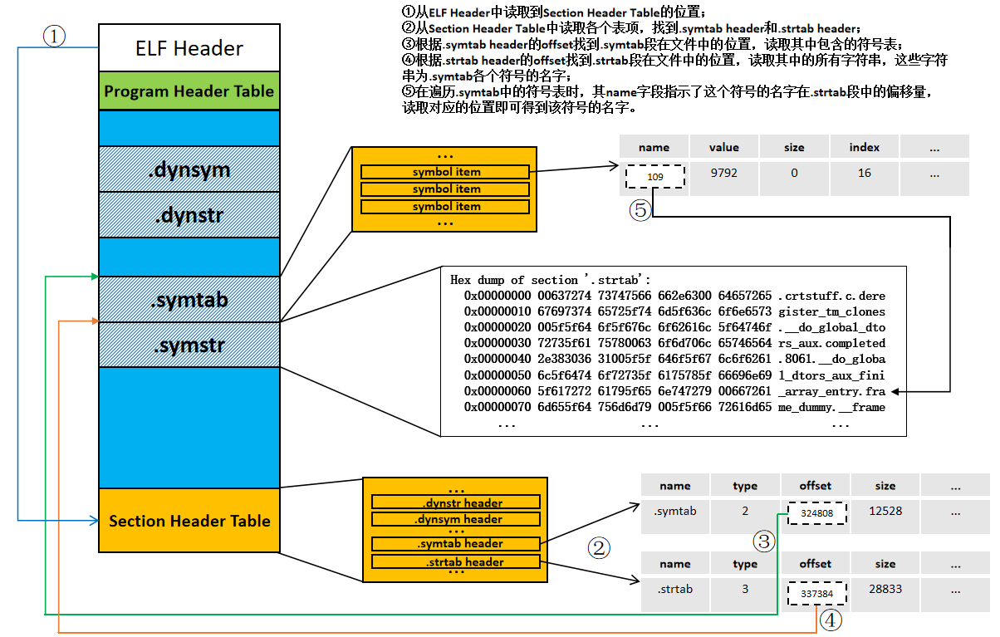

相关内容已同步于CSDN：[ELF文件信息一览](https://blog.csdn.net/GodNotAMen/article/details/135316775)

--------------
参考链接：
[静态链接和加载；最小动态加载器[南京大学(蒋炎岩)] ](https://www.bilibili.com/video/BV1RM4y1b7g2/?share_source=copy_web&vd_source=bad63bc206890ec49ce3dba8cc7b7a37)
[深入理解计算机系统——链接](https://www.bilibili.com/video/BV17K4y1N7Q2?p=18)
[从零开始实现链接器——第二课](https://www.bilibili.com/video/BV11G4y147bo/?share_source=copy_web&vd_source=bad63bc206890ec49ce3dba8cc7b7a37)
[https://en.wikipedia.org/wiki/GNU_Binutils](https://en.wikipedia.org/wiki/GNU_Binutils)

### 了解elf文件中的调试信息
有时候编译好程序调试的时候，虽然设置了断点，但程序并没有在断点的位置停下来。这可能是由于编译时没有创建调试信息。当使用`g++`编译程序时，通过`-g`参数可生成调试信息：
```shell
$ g++ -g elfinfo.cpp -o elfinfo
$ file elfinfo
elfinfo: ELF 64-bit LSB pie executable, x86-64, version 1 (SYSV), dynamically linked, interpreter /lib64/ld-linux-x86-64.so.2, BuildID[sha1]=c814baea7a3040d5463c6a203dfb82c8a7f235b1, for GNU/Linux 3.2.0, with debug_info, not stripped
$ readelf -S elfinfo | grep debug
  [29] .debug_aranges    PROGBITS         0000000000000000  00007043
  [30] .debug_info       PROGBITS         0000000000000000  000075d3
  [31] .debug_abbrev     PROGBITS         0000000000000000  00010cf5
  [32] .debug_line       PROGBITS         0000000000000000  000118bb
  [33] .debug_str        PROGBITS         0000000000000000  00012a7f
  [34] .debug_line_str   PROGBITS         0000000000000000  0001cb79
  [35] .debug_rnglists   PROGBITS         0000000000000000  0001cfa1
```
上面的命令先带`-g`去编译程序，通过`file`命令看到最后的信息为`with debug_info, not stripped`，说明时存在调试信息的，这类文件可以被调试。如果用`readelf -S elfinfo`查看Section Header Table里的信息，会发现存在一些debug段，调试器通过这些段来完成调试。**如果不带`-g`进行编译，则没有这些段，因此不能调试。**

### ELF符号信息及其读取
这部分内容通过debug代码来了解符号的读取过程会更好理解。在github上有相关的项目：[https://github.com/finixbit/elf-parser](https://github.com/finixbit/elf-parser)

有时候为了进一步缩小文件尺寸，还会使用`strip`命令删除文件中不重要的段，在strip后，通过`file`命令输出的信息中会显示`stripped`。当对比strip文件和未被strip的文件时，会发现strip后的文件少了两个段.symtab和.strtab。同时`nm`命令的输出结果为空，如下：

```console
$ g++ elfinfo.cpp  -o elfinfo
$ nm -a ./elfinfo | wc
    186     507   11412
$ strip elfinfo
$ nm -a ./elfinfo | wc
nm: ./elfinfo: no symbols
      0       0       0
```
实际上符号有静态和动态两类，在strip后，只删除了静态符号（对应.symstr和.strtab），动态符号（对应.dynsym和.dynstr）依然保留，他们可以通过`nm -D ./your_elf_file_path`来查看。

**在elf文件中，符号信息保存在`.symstr`和`.dynsym`段中，这两个段其实就是两个数组，数组中的每个元素代表一条符号信息，每元素的长度是一样的。** 但我们在用readelf工具去显示其中的符号时，会发现每个符号的字符串长度各不相同，有长有短，那么字符串在这两个段中是如何保存的呢？

**这就需要用到`.strtab`和`.dynstr`两个段了。`.synstr`和`dynsym`本身并不存储符号的字符串信息，而是将其中涉及的字符串分别保存到`.strtab`和`.dynstr`两个段。**

下面是readelf命令从ELF文件中读取静态符号的过程（可在当前文件夹下使用`./symbols ./symbols`复现下面的实验）：

nm命令从符号表`.strtab`和` .symtab`中读取符号信息。通过`readelf -x .strtab your_elf_file_path`可以查看elf文件`.strtab`段的二进制内容：
```shell
$ readelf -x .strtab ./examples/sections | less
Hex dump of section '.strtab':
  0x00000000 00637274 73747566 662e6300 64657265 .crtstuff.c.dere
  0x00000010 67697374 65725f74 6d5f636c 6f6e6573 gister_tm_clones
  0x00000020 005f5f64 6f5f676c 6f62616c 5f64746f .__do_global_dto
  0x00000030 72735f61 75780063 6f6d706c 65746564 rs_aux.completed
  0x00000040 2e383036 31005f5f 646f5f67 6c6f6261 .8061.__do_globa
  0x00000050 6c5f6474 6f72735f 6175785f 66696e69 l_dtors_aux_fini
  0x00000060 5f617272 61795f65 6e747279 00667261 _array_entry.fra
```
第一列表示该行二进制的起始位置，随后四列为二进制数据，最后一列为二进制的字符串表示，这里将字符串的结束标志`00`表示为`.`。

虽然这些字符是连在一起的，但通过这样的分隔标志即可划分每个字符串，在读取的时候，并不需要知道字符串的长度信息。**在C++中，将这样的字符序列传递给`std::string`，它只会读取到第一个字符串，在`00`之后的则会被忽略。**

结合上面的图示，在每一个Section Header中，都有一个offset用于说明对应节相对elf文件开头位置的偏移量。比如上面图示中，`.symstr`段的开始位置在离文件开头位置第337384个字节处，可以通过`dd`命令来验证：
```shell
$ dd if=./symbols bs=1 skip=337384 count=300 | xxd
00000000: 0063 7274 7374 7566 662e 6300 6465 7265  .crtstuff.c.dere
00000010: 6769 7374 6572 5f74 6d5f 636c 6f6e 6573  gister_tm_clones
00000020: 005f 5f64 6f5f 676c 6f62 616c 5f64 746f  .__do_global_dto
00000030: 7273 5f61 7578 0063 6f6d 706c 6574 6564  rs_aux.completed
00000040: 2e38 3036 3100 5f5f 646f 5f67 6c6f 6261  .8061.__do_globa
00000050: 6c5f 6474 6f72 735f 6175 785f 6669 6e69  l_dtors_aux_fini
00000060: 5f61 7272 6179 5f65 6e74 7279 0066 7261  _array_entry.fra
00000070: 6d65 5f64 756d 6d79 005f 5f66 7261 6d65  me_dummy.__frame
00000080: 5f64 756d 6d79 5f69 6e69 745f 6172 7261  _dummy_init_arra
00000090: 795f 656e 7472 7900 7379 6d62 6f6c 732e  y_entry.symbols.
```
这和先前由`readelf -x .strtab ./examples/sections`读取到的内容一致。